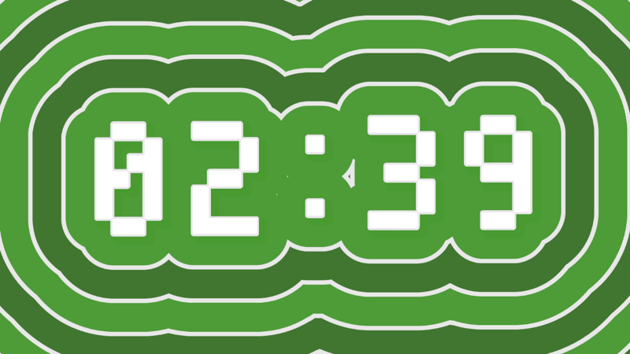

# Haokan-Clock 好看时钟



一个基于Unity开发的具有视觉效果的倒计时钟应用。

## 功能特性

### 🕒 倒计时功能
- 设置目标日期时间
- 实时显示剩余时间（小时、分钟、秒、毫秒）
- 到达目标时间后自动开始倒计时模式

### 🎨 视觉效果
- **Jump Flooding Algorithm (JFA)**: 实现距离场生成，用于创建平滑的轮廓和填充效果
- **涟漪效果**: ContourFill涟漪着色器，支持动态水波纹效果
- **波浪动画**: 时钟元素带有波浪运动效果

### 🛠️ 技术特性
- 使用Unity Universal Render Pipeline (URP)
- 支持Compute Shader进行GPU加速计算
- 自定义Editor工具和只读属性显示
- 响应式时间显示和状态管理

## 项目结构

```
Assets/
├── Scripts/
│   ├── Clock.cs                 # 主时钟逻辑脚本
│   ├── Wave.cs                  # 波浪动画组件
│   ├── JFADistanceField.cs      # 距离场生成算法
│   ├── ShowH.cs                 # 辅助显示脚本
│   ├── ShowOutRT.cs             # 渲染纹理显示脚本
│   └── Editor/
│       ├── ReadOnlyAttribute.cs # 只读属性特性
│       └── ReadOnlyDrawer.cs    # 只读属性绘制器
├── Shaders/
│   ├── JumpFlood.compute        # JFA计算着色器
│   ├── ContourFill_Ripple_URP2D.shader # 涟漪填充着色器
│   └── URP2D_ContourFillRipple.mat # 涟漪材质
├── Materials/                   # 材质文件
├── Scenes/
│   └── Main.unity               # 主场景
└── TextMesh Pro/               # 文本渲染资源
```

## 快速开始

### 环境要求
- Unity 2021.3 或更高版本
- Universal Render Pipeline (URP) 已安装

### 安装步骤
1. 克隆或下载项目
2. 使用Unity打开项目
3. 打开 `Assets/Scenes/Main.unity` 场景
4. 在场景中找到Clock对象并配置时间设置
5. 运行场景

### 配置时钟
在Clock组件的Inspector中设置：
- **目标年份**: 倒计时的目标年份
- **目标月份**: 目标月份 (1-12)
- **目标日期**: 目标日期 (1-31)
- **目标小时**: 目标小时 (0-23)
- **目标分钟**: 目标分钟 (0-59)
- **目标秒数**: 目标秒数 (0-59)

## 核心组件说明

### Clock.cs
主时钟控制器，负责：
- 时间戳计算和转换
- 倒计时逻辑
- UI状态更新

### JFADistanceField.cs
距离场生成器，使用Jump Flooding Algorithm：
- 生成字体轮廓的距离场
- 支持内外距离计算
- 可选的平滑处理

### Wave.cs
波浪动画组件：
- 简单的正弦波运动
- 可调节振幅、速度和偏移

## 自定义编辑器工具

### ReadOnlyAttribute
在Inspector中创建只读字段，用于显示计算结果：
```csharp
[ReadOnly]
public int displayValue;
```

## 技术实现

### Jump Flooding Algorithm
项目实现了高效的距离场生成算法：
- 使用Compute Shader进行GPU加速
- 支持多遍迭代计算
- 生成精确的像素级距离信息

### 渲染管线集成
- 完全兼容URP 2D渲染
- 自定义着色器用于视觉效果
- 高效的渲染纹理管理

## 使用场景

- 活动倒计时显示
- 节日主题时钟
- 视觉效果演示
- 教育性时间概念展示

## 许可证

本项目采用 MIT 许可证 - 查看 [LICENSE](LICENSE) 文件了解详情

## 贡献

欢迎提交Issue和Pull Request来改进项目。

## 版本历史

- v1.0.0: 初始版本，包含基础倒计时和视觉效果功能
